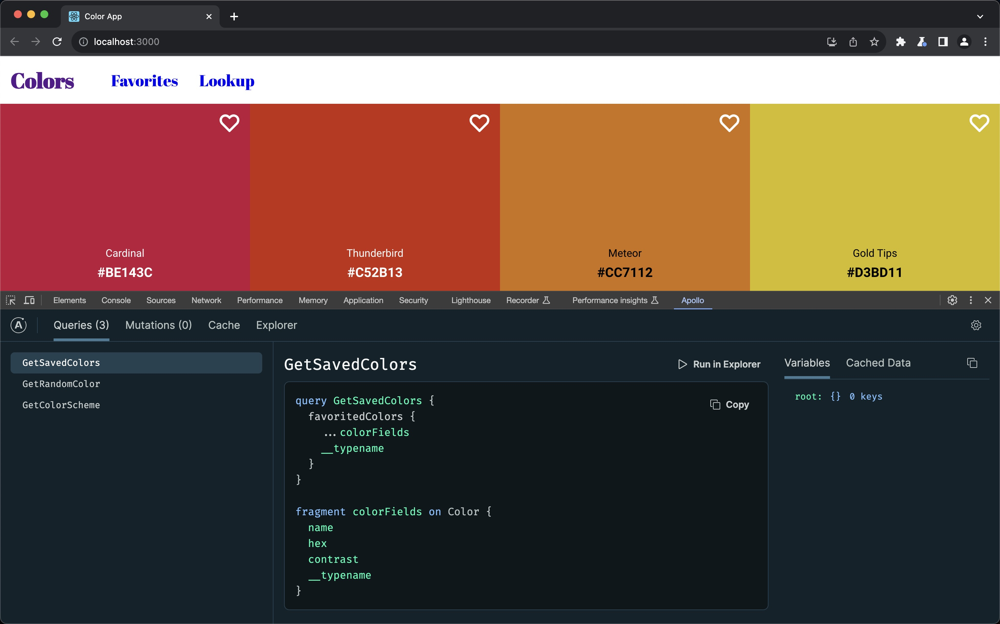

<div align="center">

<p>
	<a href="https://www.apollographql.com/"></a>
</p>
<h1>Apollo Client Devtools</h1>

[![Chrome Web Store][ChromeWebStoreBadge]][WebStore] [![Addons.mozilla.org][FirefoxAddonBadge]][Amo] [](https://circleci.com/gh/apollographql/apollo-client-devtools)

</div>

This repository contains the Apollo Client Browser Devtools extension for Chrome & Firefox.

| ☑️ Apollo Client User Survey                                                                                                                                                                                                                                                                                                                                                             |
| :--------------------------------------------------------------------------------------------------------------------------------------------------------------------------------------------------------------------------------------------------------------------------------------------------------------------------------------------------------------------------------------- |
| What do you like best about Apollo Client? What needs to be improved? Please tell us by taking a [one-minute survey](https://docs.google.com/forms/d/e/1FAIpQLSczNDXfJne3ZUOXjk9Ursm9JYvhTh1_nFTDfdq3XBAFWCzplQ/viewform?usp=pp_url&entry.1170701325=Apollo+Client&entry.204965213=Readme). Your responses will help us understand Apollo Client usage and allow us to serve you better. |

## Installation

### Chrome Web Store

Chrome users can install the extension by visiting the [Chrome Web Store](https://chrome.google.com/webstore/detail/apollo-client-developer-t/jdkknkkbebbapilgoeccciglkfbmbnfm).

Opera users can install the extension from Chrome Web Store using the [Download Chrome Extension](https://addons.opera.com/extensions/details/app_id/kipjbhgniklcnglfaldilecjomjaddfi) addon for Opera.

### Firefox

Firefox users can install the addon via [Firefox Browser Add-ons](https://addons.mozilla.org/firefox/addon/apollo-developer-tools/).

### Install local version

If you want to install a local version of the extension instead, skip ahead to the [Developing](#Developing) section.

## Features

The Apollo Client Browser Devtools appear as an "Apollo" tab in your web browser inspector, alongside other tabs like "Elements" and "Console". The devtools currently have four main features:

- **Explorer:** A built-in version of the Apollo Studio Explorer that allows you to make queries against your GraphQL server using your app's network interface directly (no configuration necessary).
- **Watched query inspector:** View active queries, variables, cached results, and re-run individual queries.
- **Mutation inspector:** View fired mutations, variables, and re-run individual mutations.
- **Cache inspector:** Visualize the Apollo Client cache and search through it by field names and/or values.



## Apollo Client version support

> if you are using an older version of Apollo Client and have issues with our Client Browser Devtools we recommend you upgrade to the latest version of Apollo Client.

- We provide active support for the current minor release of [Apollo Client](https://github.com/apollographql/apollo-client) for use with our Client Browser DevTools.
- We do our best to support older `3.x` versions of [Apollo Client](https://github.com/apollographql/apollo-client/releases) for use with our Client Browser DevTools.
- We do not offer support of `2.x` versions of [Apollo Client](https://github.com/apollographql/apollo-client/releases) for use with our Client Browser DevTools.

### Configuration

While your application is in dev mode, the devtools will appear as an "Apollo" tab in your web browser inspector. To enable the devtools for your application in production, pass `connectToDevTools: true` to the ApolloClient constructor in your application. Pass `connectToDevTools: false` if want to manually disable this functionality.

The "Apollo" tab will appear in your web browser inspector if a global `window.__APOLLO_CLIENT__` object exists in your application. Apollo Client adds this hook to the window automatically unless `process.env.NODE_ENV === 'production'`. If you would like to use the devtools in production, manually attach your Apollo Client instance to `window.__APOLLO_CLIENT__` or pass `connectToDevTools: true` to the constructor.

If you are seeing the "Apollo" tab but are still having issues, skip ahead to the [Debugging](#Debugging) section.

## Developing

### Build the extension

Before building the extension you should install dependencies:

```sh
# Install dependencies
> npm install

# (Optional) build the extension for local use
> npm run build -- --env TARGET=chrome
# or
> npm run build -- --env TARGET=firefox

# Or generate zipped distributables (already includes the above build step)
> npm run dist:chrome
# or
> npm run dist:firefox
```

### Running the sample application

[Read more](https://github.com/apollographql/apollo-client-devtools/wiki/Running-the-sample-application).

### Development with web-ext & WebExtWebpackPlugin

[Read more](https://github.com/apollographql/apollo-client-devtools/wiki/Development-with-web%E2%80%90ext-&-WebExtWebpackPlugin).

### Tests

We use [Jest](https://jestjs.io/) and [React Testing Library](https://testing-library.com/docs/react-testing-library/intro) to write and run our tests.

To run tests for both `src` and `development`, run the following command:

```bash
npm run test
```

You can also run with `--watch` to watch and re-run tests automatically:

```bash
npm run test:watch
```

### Folder structure

[Read more](https://github.com/apollographql/apollo-client-devtools/wiki/Folder-structure).

### Debugging

[Read more](https://github.com/apollographql/apollo-client-devtools/wiki/Debugging).

### Testing locally

[Read more](https://github.com/apollographql/apollo-client-devtools/wiki/Testing-locally).

## Code of Conduct

This project is governed by the [Apollo Code of Conduct](https://www.apollographql.com/docs/community/code-of-conduct/).

## Who is Apollo?

[Apollo](https://apollographql.com/) builds open-source software and a graph platform to unify GraphQL across your apps and services. We help you ship faster with:

- [Apollo Studio](https://www.apollographql.com/studio/develop/) – A free, end-to-end platform for managing your GraphQL lifecycle. Track your GraphQL schemas in a hosted registry to create a source of truth for everything in your graph. Studio provides an IDE (Apollo Explorer) so you can explore data, collaborate on queries, observe usage, and safely make schema changes.
- [Apollo Federation](https://www.apollographql.com/apollo-federation) – The industry-standard open architecture for building a distributed graph. Use Apollo’s gateway to compose a unified graph from multiple subgraphs, determine a query plan, and route requests across your services.
- [Apollo Client](https://www.apollographql.com/apollo-client/) – The most popular GraphQL client for the web. Apollo also builds and maintains [Apollo iOS](https://github.com/apollographql/apollo-ios) and [Apollo Kotlin](https://github.com/apollographql/apollo-kotlin).
- [Apollo Server](https://www.apollographql.com/docs/apollo-server/) – A production-ready JavaScript GraphQL server that connects to any microservice, API, or database. Compatible with all popular JavaScript frameworks and deployable in serverless environments.

## Learn how to build with Apollo

Check out the [Odyssey](https://odyssey.apollographql.com/) learning platform, the perfect place to start your GraphQL journey with videos and interactive code challenges. Join the [Apollo Community](https://community.apollographql.com/) to interact with and get technical help from the GraphQL community.

## Maintainers

| Name               | Username                                       |
| ------------------ | ---------------------------------------------- |
| Ben Newman         | [@benjamn](https://github.com/benjamn)         |
| Alessia Bellisario | [@alessbell](https://github.com/alessbell)     |
| Jeff Auriemma      | [@bignimbus](https://github.com/bignimbus)     |
| Hugh Willson       | [@hwillson](https://github.com/hwillson)       |
| Jerel Miller       | [@jerelmiller](https://github.com/jerelmiller) |
| Lenz Weber-Tronic  | [@phryneas](https://github.com/phryneas)       |

<!-- Badges -->

[FirefoxAddonBadge]: https://img.shields.io/amo/v/apollo-developer-tools.svg?label=firefox&logo=firefox-browser&logoColor=white
[ChromeWebStoreBadge]: https://img.shields.io/chrome-web-store/v/jdkknkkbebbapilgoeccciglkfbmbnfm.svg?label=chrome&logo=google-chrome&logoColor=white

<!-- Download -->

[Amo]: https://addons.mozilla.org/en-US/firefox/addon/apollo-developer-tools/
[WebStore]: https://chrome.google.com/webstore/detail/apollo-client-devtools/jdkknkkbebbapilgoeccciglkfbmbnfm

<!-- Related pages -->

[Apollo Community Forum]: https://community.apollographql.com/
